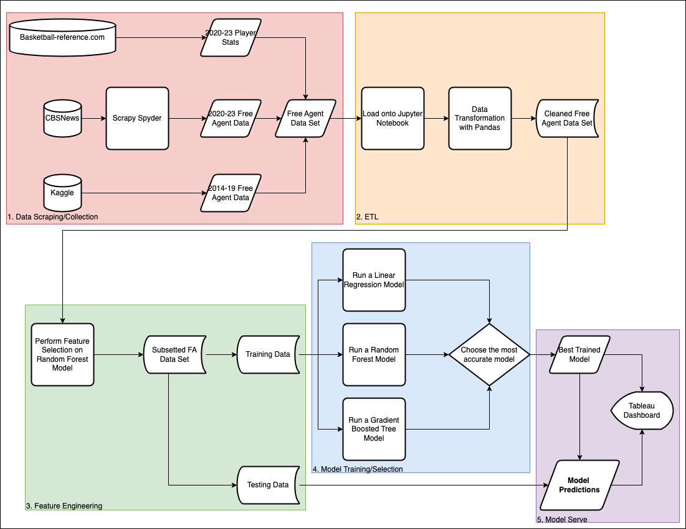
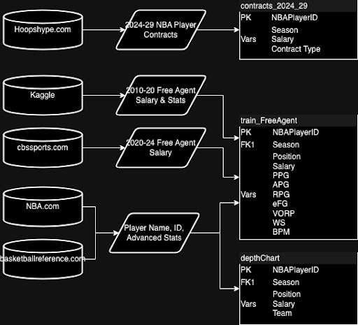

# Predicting NBA 2024 Free Agent Salaries in Python

This project predicts the value of NBA Free Agents in 2024 by a machine learning (ML) model trained on the player's previous year basic and advanced statistics.

## File Organization

Here is how to navigate through the project:

```
|-finance
   |---advanced_stats
     |---CSV files of player stats from 2014-23
   |---cleaned_data
     |---CSV files of cleaned datasets
   |---finance
     |---Spyders for scraping
   |---intermediate_data
     |---CSV files of intermediate datasets
   |---models
     |---.pkl objects of trained models
   |---output
     |---CSV files of final predictions
   |---raw_data
     |---Raw CSV data sources
   |---.ipynb notebooks for ETL and Modeling
   |---SQL DB
```

## Abstract

NBA Free Agency is one of the most critical periods of the year for many organizations. With all the moving parts during the offseason, deciding on which players to sign and how much to pay them is difficult to identify quickly. The objective of this project answers this conundrum by building a model to streamline the process of deciding an **estimated player salary based on their previous stats, accolades, and contracts.** This model is pipelined into a financial dashboard of each NBA team’s payroll for the 24-25 season.These two components work in tandem to identify the positions that are lacking for each team, and identify potential free agents who would fit in their 2024-25 payroll situation.

Our **objective** is to build NBA offseason dashboards to be used by GMs to evaluate potential offseason moves and initiatives for their respective teams.

## Project Workflow



The project workflow follows the barebones machine learning (ML) pipeline:
1. Collecting Data
2. ETL
3. Feature Engineering
4. Model Training
5. Model Serving



Above is the data schema listing the sources and the major variables used from each data source to curate our training data for the model predicting player salaries.

## References

Basketball-Reference was used to make this project viable, with various data sources from [depth charts](https://www.basketball-reference.com/teams/ATL/2024_depth.html), to player regular and [advanced statistics](https://www.basketball-reference.com/leagues/NBA_2024_per_game.html).

NBA.com has an [API](https://github.com/swar/nba_api/tree/master) accessible and compatible with Python to obtain official statistics and biographical data of NBA players.

Kaggle is an open-source repository for datasets, of which we found a [dataset with NBA Free Agents](https://www.kaggle.com/datasets/jarosawjaworski/current-nba-players-contracts-history) and their contracts signed from 2010-20.

CBS News provides a news article summarizing the [2020](https://www.cbssports.com/nba/news/2020-nba-free-agency-tracker-anthony-davis-re-signs-with-lakers-bogdan-bogdanovic-joins-hawks/), [2021](https://www.cbssports.com/nba/news/nba-free-agency-tracker-2021-lakers-reload-with-carmelo-anthony-dwight-howard-other-vets-bulls-make-moves/), [2022](https://www.cbssports.com/nba/news/2022-nba-free-agency-tracker-james-harden-76ers-agree-to-two-year-deal-raptors-sign-juancho-hernangomez/), [2023](https://www.cbssports.com/nba/news/2023-nba-free-agency-tracker-latest-deals-signings-with-notable-names-still-available/) Free Agency class and deals.
